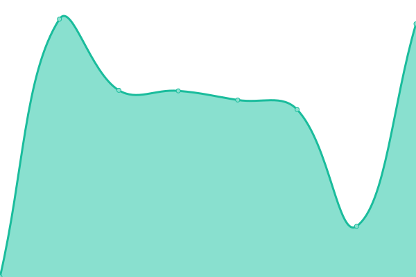

# [📈 Live Status](https://davelopware.github.io/monitoring-public/): <!--live status--> **🟩 All systems operational**

This repository contains the uptime monitor config and status page for [Davelopware](https://github.com/davelopware), powered by [Upptime](https://github.com/upptime/upptime).

<!--start: status pages-->
<!-- This summary is generated by Upptime (https://github.com/upptime/upptime) -->
<!-- Do not edit this manually, your changes will be overwritten -->
<!-- prettier-ignore -->
| URL | Status | History | Response Time | Uptime |
| --- | ------ | ------- | ------------- | ------ |
|  [Davelopware Public Website](https://davelopware.com/) | 🟩 Up | [davelopware-public-website.yml](https://github.com/davelopware/monitoring-public/commits/HEAD/history/davelopware-public-website.yml) | 

 103ms
     
 | 

<a href="https://davelopware.github.io/monitoring-public/history/davelopware-public-website">100.00%</a>
    

|  [UK Space News](https://ukspacenews.com/) | 🟩 Up | [uk-space-news.yml](https://github.com/davelopware/monitoring-public/commits/HEAD/history/uk-space-news.yml) | 

 1625ms
     
 | 

<a href="https://davelopware.github.io/monitoring-public/history/uk-space-news">99.58%</a>
    

|  [Google (Just testing the monitoring is working)](https://www.google.com) | 🟩 Up | [google-just-testing-the-monitoring-is-working.yml](https://github.com/davelopware/monitoring-public/commits/HEAD/history/google-just-testing-the-monitoring-is-working.yml) | 

 93ms
     
 | 

<a href="https://davelopware.github.io/monitoring-public/history/google-just-testing-the-monitoring-is-working">100.00%</a>
    

<!--end: status pages-->

With [Upptime](https://upptime.js.org), you can get your own unlimited and free uptime monitor and status page, powered entirely by a GitHub repository. We use [Issues](https://github.com/upptime/upptime/issues) as incident reports, [Actions](https://github.com/davelopware/monitoring-public/actions) as uptime monitors, and [Pages](https://upptime.github.io/upptime) for the status page.
[**Visit Upptime status website →**](https://upptime.github.io/upptime)

## 📄 License

- Powered by: [Upptime](https://github.com/upptime/upptime)
- Code: [MIT](./LICENSE) © [Upptime](https://upptime.js.org)
- Data in the `./history` directory: [Open Database License](https://opendatacommons.org/licenses/odbl/1-0/)
